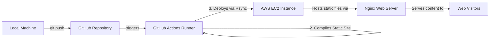

# Blog Auto-Deploy

A production-grade personal blog featuring an automated CI/CD pipeline that compiles, optimizes, and deploys a static Hugo blog directly to an AWS EC2 instance using GitHub Actions.

---

## 🚀 Architecture Workflow



---

## ✨ Features

- **Lightning-Fast Generation:** Powered by **Hugo**, building pages in milliseconds.
- **Automated CI/CD:** Complete continuous integration and continuous deployment pipeline using **GitHub Actions**.
- **Modern UI/UX:** Styled using the responsive **Ananke Theme**.
- **Interactive Comments:** Database-less comment system powered by **Giscus** and **GitHub Discussions**.
- **Production Web Server:** High-performance serving via **Nginx** reverse proxy hosted on **AWS EC2**.

---

## 🛠️ Tech Stack

- **Static Site Generator:** Hugo (v0.111.3)
- **Styling/Theme:** HTML, CSS (Ananke)
- **Deployment Platform:** GitHub Actions
- **Hosting:** AWS EC2
- **Web Server:** Nginx
- **Comments:** Giscus (GitHub API & OAuth)

---

## 💻 Local Setup & Development

Follow these steps to run the project on your local machine:

### 1. Prerequisites
Ensure you have Git installed. You can run the project either using your system's global Hugo installation or using the local binary provided in the `hugo_bin` directory.

### 2. Run the Development Server
To start the local server and watch for live changes (including posts marked as drafts):

```bash
# Using the local project binary (recommended to match production)
.\hugo_bin\hugo.exe server -D

# Or if you have Hugo installed globally:
hugo server -D
```

Once running, open your web browser and navigate to:
👉 **[http://localhost:1313/](http://localhost:1313/)**

### 3. Creating a New Blog Post
To generate a new post template with correct front matter:

```bash
.\hugo_bin\hugo.exe new posts/my-new-post.md
```
Open `content/posts/my-new-post.md` in your text editor, write your post in Markdown, and set `draft = false` when ready to publish.

### 4. Build Static Files Locally
If you want to compile and minify the HTML/CSS website assets locally (output will go to `./public/`):

```bash
.\hugo_bin\hugo.exe --minify
```

---

## 🌐 Production Deployment

The project deploys automatically whenever changes are pushed to the `main` or `hugo-stable-test` branches. 

### GitHub Actions Configuration
The pipeline relies on the following GitHub Repository Secrets under **Settings > Secrets and variables > Actions**:

| Secret Name | Description |
|---|---|
| `SSH_PRIVATE_KEY` | SSH Private Key to access the AWS EC2 instance |
| `DEPLOY_HOST` | Public IP Address or Domain of your AWS EC2 instance |
| `DEPLOY_USER` | SSH login username (e.g., `ubuntu`) |
| `DEPLOY_PATH` | Server directory where Nginx hosts the files (e.g., `/var/www/html`) |
